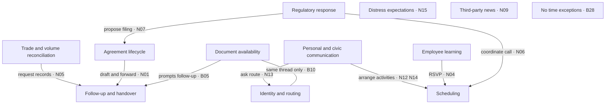

# Concept mapping example: 19 records

DS-20260905-S24. Worked example complete; session remains open for operator review. Self-checked, not independently assured.

## What changed

The operator revised the design to 15 additional substantive emails alongside the four useful S23 records. The combined sample is 19: Bailey 9, Rapp 5, Pereira 5. The 50-record design and held-out split were superseded. All sources are from D:; attachments were excluded.

The extraction considered 24 candidates for the 15 additions. Screening decisions: {'provisionally_selected': 15, 'empty_usable_body': 8, 'excluded_original_sample': 1}. One provisional Rapp record contained nested transport headers only; it was rejected and replaced with the next ranked eligible record, with the original extraction retained.

## Read the map

Nodes are analyst-defined concepts; arrows are labelled relationships supported by the cited records. A connection is not proof of causation. C09, C10 and C11 remain separate rather than forcing a connection unsupported by this sample.

## Concept definitions and sample support

| Concept | Definition / boundary | Records |
|---|---|---|
| Agreement lifecycle | Drafting, revising, signing or assessing permissions under an agreement; distinguish a proposed action from completion. | [B05](../02_RESULTS/B05.txt), [N01](../02_RESULTS/N01.txt), [N07](../02_RESULTS/N07.txt), [N08](../02_RESULTS/N08.txt), [N10](../02_RESULTS/N10.txt) |
| Document availability and completeness | Whether required copies or document sets are available; absence of a copy is not absence of an agreement. | [B05](../02_RESULTS/B05.txt), [B10](../02_RESULTS/B10.txt) |
| Follow-up and handover | Requests, reminders, responsibility assignment and onward document delivery; intentions are not completed transfers. | [B05](../02_RESULTS/B05.txt), [B10](../02_RESULTS/B10.txt), [N01](../02_RESULTS/N01.txt), [N05](../02_RESULTS/N05.txt), [N10](../02_RESULTS/N10.txt) |
| Identity and communication routing | Resolving recipients or asking which communication route to use; a routing question is not an established rule. | [B10](../02_RESULTS/B10.txt), [N13](../02_RESULTS/N13.txt) |
| Trade and volume reconciliation | Reviewing trades, deal status, pricing or scheduled versus allocated volumes; underlying records remain unverified. | [B02](../02_RESULTS/B02.txt), [N05](../02_RESULTS/N05.txt), [N11](../02_RESULTS/N11.txt) |
| Regulatory response and filing | Preparing a response or discussing which contracts should be filed; these are participants' positions, not legal determinations. | [N06](../02_RESULTS/N06.txt), [N07](../02_RESULTS/N07.txt) |
| Scheduling and coordination | Arranging, postponing or cancelling calls, meetings or activities; tentative timings remain tentative. | [N03](../02_RESULTS/N03.txt), [N04](../02_RESULTS/N04.txt), [N06](../02_RESULTS/N06.txt), [N07](../02_RESULTS/N07.txt), [N12](../02_RESULTS/N12.txt), [N14](../02_RESULTS/N14.txt) |
| Employee learning | Invitations to structured learning; an invitation does not establish attendance or case-specific advice. | [N04](../02_RESULTS/N04.txt) |
| Distress expectations | Statements forecasting bankruptcy, default or employment consequences; preserve uncertainty and prediction time. | [N15](../02_RESULTS/N15.txt) |
| Third-party news | Externally authored news circulated in a mailbox; receipt does not establish the recipient's belief or independent corroboration. | [N09](../02_RESULTS/N09.txt) |
| Time-exception reporting | A report about exceptions for a reporting period, including explicit reports of none. | [B28](../02_RESULTS/B28.txt) |
| Personal and civic communication | Social, leisure or community communications; do not force these into a business-risk interpretation. | [N02](../02_RESULTS/N02.txt), [N12](../02_RESULTS/N12.txt), [N13](../02_RESULTS/N13.txt), [N14](../02_RESULTS/N14.txt) |

## Relationship evidence

| Relation | Records | Interpretation limit |
|---|---|---|
| Document availability and completeness **motivates a request for** Follow-up and handover | B05 (E02;E03) | Reported unavailable copies and subsequent reminder. |
| Agreement lifecycle **assigns next handling through** Follow-up and handover | N01 (E08) | Drafting and forwarding are requested in the same sentence. |
| Trade and volume reconciliation **requests supporting records through** Follow-up and handover | N05 (E13) | Investigation asks for confirmations or listings. |
| Regulatory response and filing **proposes filing of** Agreement lifecycle | N07 (E17) | Material deviation is stated as the reason to file; not a legal conclusion. |
| Document availability and completeness **is discussed alongside** Identity and communication routing | B10 (E04;E06) | Same thread; co-occurrence only, not proof routing caused the document gap. |
| Regulatory response and filing **is coordinated through** Scheduling and coordination | N06 (E15;E16) | Participants propose a call to discuss the response. |
| Employee learning **requires registration and scheduling via** Scheduling and coordination | N04 (E11;E12) | Training announcement sets RSVP and session arrangements. |
| Personal and civic communication **uses** Scheduling and coordination | N12;N14 (E27;E30) | Availability request and conditional rescheduling, not confirmed events. |
| Personal and civic communication **asks about** Identity and communication routing | N13 (E28;E29) | Proposed consultation raises a routing question. |

## Where meaning would be lost by keyword-only coding

- **N08:** a question about contractual control is answered "No, unfortunately not." Coding only the question would reverse the meaning.
- **B05:** a missing executed copy is not proof that the agreement was unexecuted.
- **N05:** a quoted list says a trade **may** be booked incorrectly. This remains an unverified possibility.
- **N15:** bankruptcy and defaults are **forecasts** by the sender, not verified events. No attempt was made to validate historical outcomes.
- **N09:** a newsletter is third-party reportage. Its presence does not prove that the recipient read it or shared its claims. It is coded at the news-provenance level; all newsletter subtopics have not been exhaustively mapped.
- **N14:** timing is tentative and pending approval. **B28** explicitly reports **no** time exceptions.
- **N01:** the outer sender fields are blank; Wendy is a body signature. Identity has not been resolved beyond that.

## Coverage of all 19 records

| ID | Record type | Concepts |
|---|---|---|
| [B02](../02_RESULTS/B02.txt) | business correspondence | C05 |
| [B05](../02_RESULTS/B05.txt) | business correspondence | C01, C02, C03 |
| [B10](../02_RESULTS/B10.txt) | business correspondence | C02, C03, C04 |
| [B28](../02_RESULTS/B28.txt) | business correspondence | C11 |
| [N01](../02_RESULTS/N01.txt) | business correspondence | C01, C03 |
| [N02](../02_RESULTS/N02.txt) | personal correspondence | C12 |
| [N03](../02_RESULTS/N03.txt) | corporate announcement | C07 |
| [N04](../02_RESULTS/N04.txt) | training announcement | C07, C08 |
| [N05](../02_RESULTS/N05.txt) | business correspondence | C03, C05 |
| [N06](../02_RESULTS/N06.txt) | business correspondence | C06, C07 |
| [N07](../02_RESULTS/N07.txt) | business correspondence | C01, C06, C07 |
| [N08](../02_RESULTS/N08.txt) | business correspondence | C01 |
| [N09](../02_RESULTS/N09.txt) | third-party newsletter | C10 |
| [N10](../02_RESULTS/N10.txt) | business correspondence | C01, C03 |
| [N11](../02_RESULTS/N11.txt) | business correspondence | C05 |
| [N12](../02_RESULTS/N12.txt) | personal scheduling | C07, C12 |
| [N13](../02_RESULTS/N13.txt) | civic correspondence | C04, C12 |
| [N14](../02_RESULTS/N14.txt) | personal scheduling announcement | C07, C12 |
| [N15](../02_RESULTS/N15.txt) | personal correspondence containing business forecasts | C09 |

## Limits and reproduction

This is convenience selection across three small archives, followed by deterministic ranking and recorded body screening. It is neither random sampling of the whole corpus nor a saturation or accuracy study. The text threshold favors longer messages and may exclude meaningful short ones. Personal messages and a newsletter were retained rather than replaced for business relevance. The concepts are not exhaustive.

The four inherited records were selected because S23 found substantive text. The new records are therefore an extension sample, not a new probability sample. All 19 lack exact normalized-body duplicates and repeated sampled Message-ID values. That does not establish semantic independence: B05/B10/N05/N06/N07/N08/N11/N15 include quoted or forwarded correspondence. Shared themes across records are not corroboration of the same event. No thread expansion was performed.

Source archive sizes and modification times were unchanged and 19 source EML hashes rechecked. All 33 evidence quotations passed whitespace-normalized substring checks. These checks establish extraction/quotation traceability, not independent semantic assurance. No attachments, archive text/XML sidecars, external links or F: sources were analyzed.

[Coded excerpts and statement types](../02_RESULTS/coded-evidence.csv), [relationship table](../02_RESULTS/relationships.csv), [codebook](../02_RESULTS/concept-codebook.csv), [source manifest](../02_RESULTS/source-manifest.csv), [screening log](../02_RESULTS/screening-log.json), [self-checks](../04_ASSURANCE/map-self-checks.json). Sampling and analysis scripts are retained in 01_ACTUAL.

Dataset attribution: ZL Technologies, Inc. (http://www.zlti.com), per EDRM source footer.